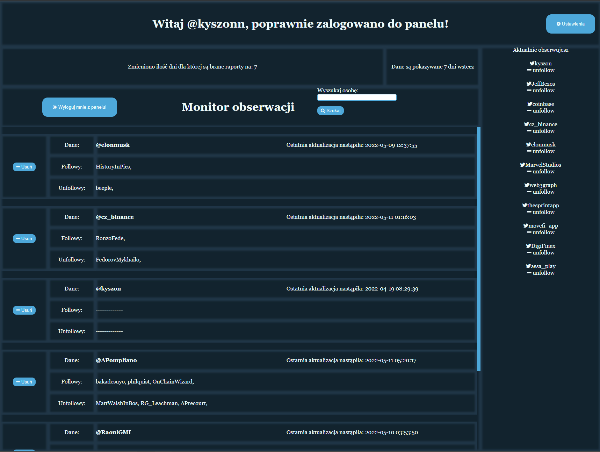

# Twitter-following-monitor

## Launch
- Create virutal enviroment: ```python3 -m venv```
- Starting virtual eviroment: Windows: ```venv\Scripts\activate.bat```; Linux: ```source venv\Scripts\activate```
- Installing libraries: ```pip install -r requirements.txt```
- In file pw.yaml paste id and secret from Twitter like in pw-example.yaml
- Starting app: ```python3 main.py```

## Technologies
- Uses python 3
- Is built on the Flask framework
- Flask framework uses login
- All datas are saved in SQLite 
- Uses Twitter api and authorization form by Twitter
- Uses threading
- Uses html/css
- Uses jinja2 with flask routes
- Uses .yaml to store secrets


## Authorization
To use this application, we need a private Twitter account, this is because twitter limits the number of requests to 15 for 15 minutes - to get the observation list.
On the index.html is button to login - However, the application does not use the app token to check the list, but the client token, which is obtained after authorization by twitter and is saved in the database in the user (OAuth) table. This means that for every user ever logged in to this application, there are 15 requests per 15 minutes

If the datas in /callback (redirected from twitter) are correct, the user will be registered / logged in to the application panel using flask_login, data for current_user will be taken from the user table.


## Description 
This program is designed to communicate with Twitter api on behalf of the user, and then retrieve information about "monitored users" (a list of their following). We will obtain from it information on recent changes in the observations of the monitored user.
- Monitored user - this is any twitter user we decide to monitor in order to see his latest follows / unfollows
- We can add any number of monitored users, they are saved in the spied_users table
- We can delete a monitored user
- It is possible to change the number of days back for which followers / unfollows of monitored users are displayed (1-7 days)
- We can follow/unfollow twitter users


